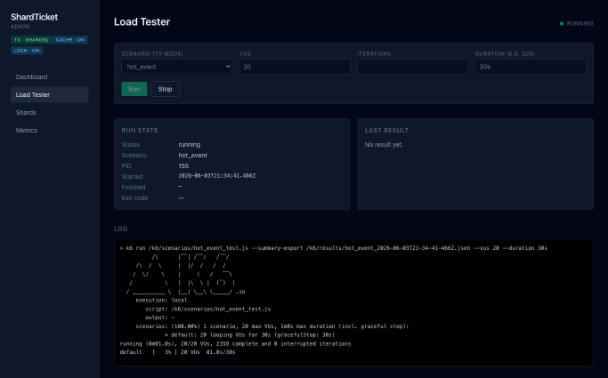
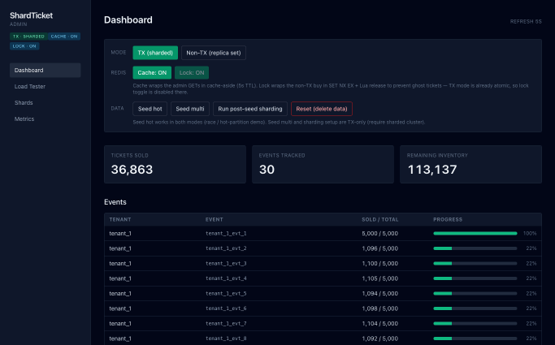
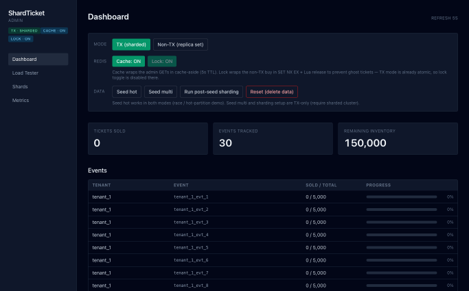
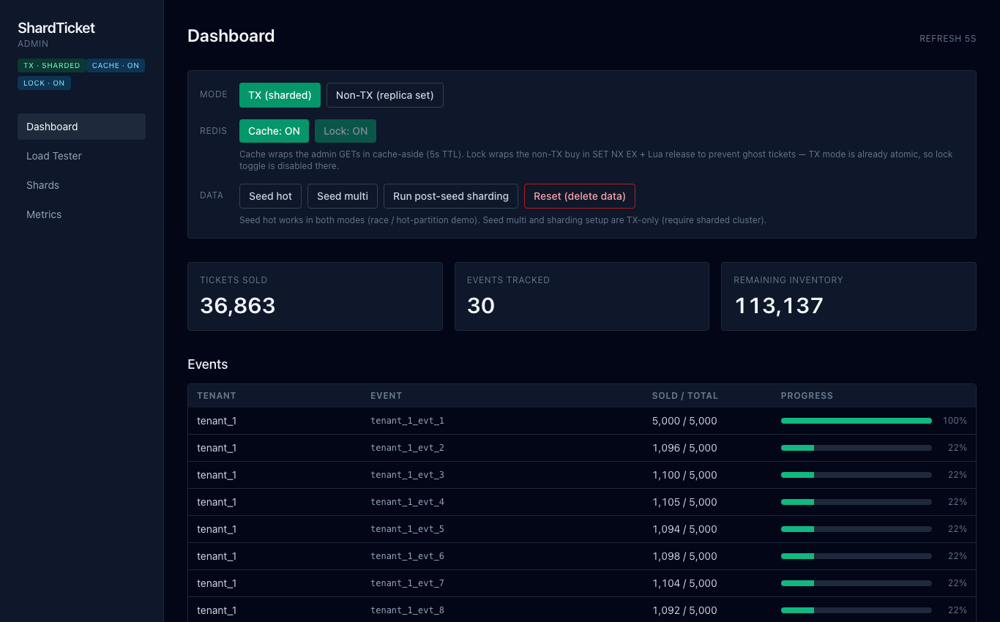
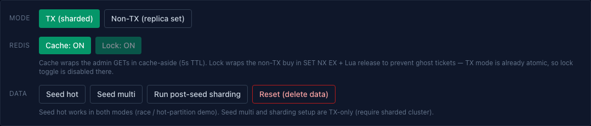
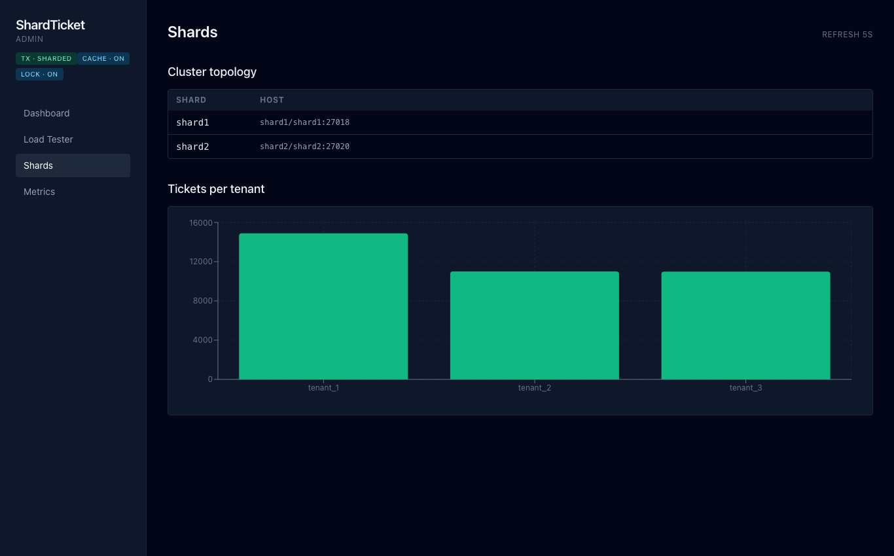
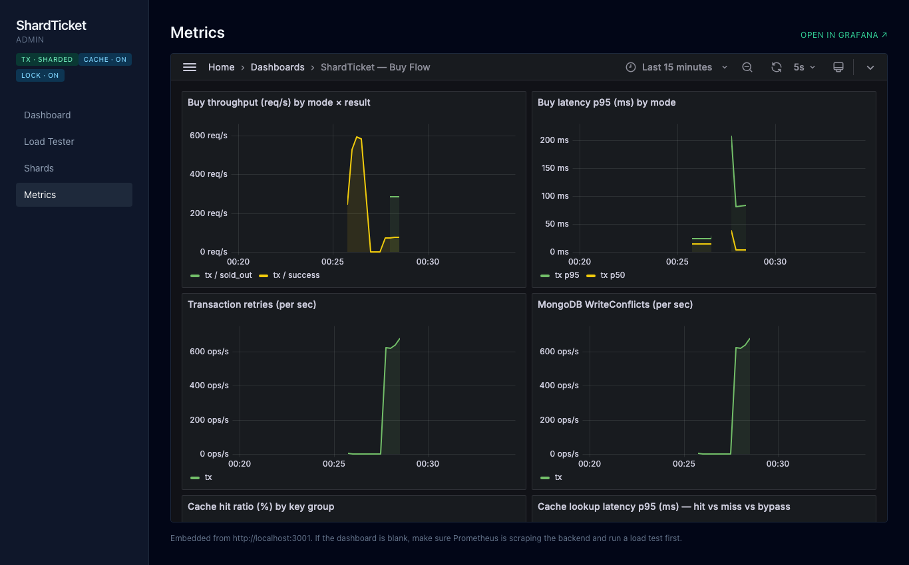
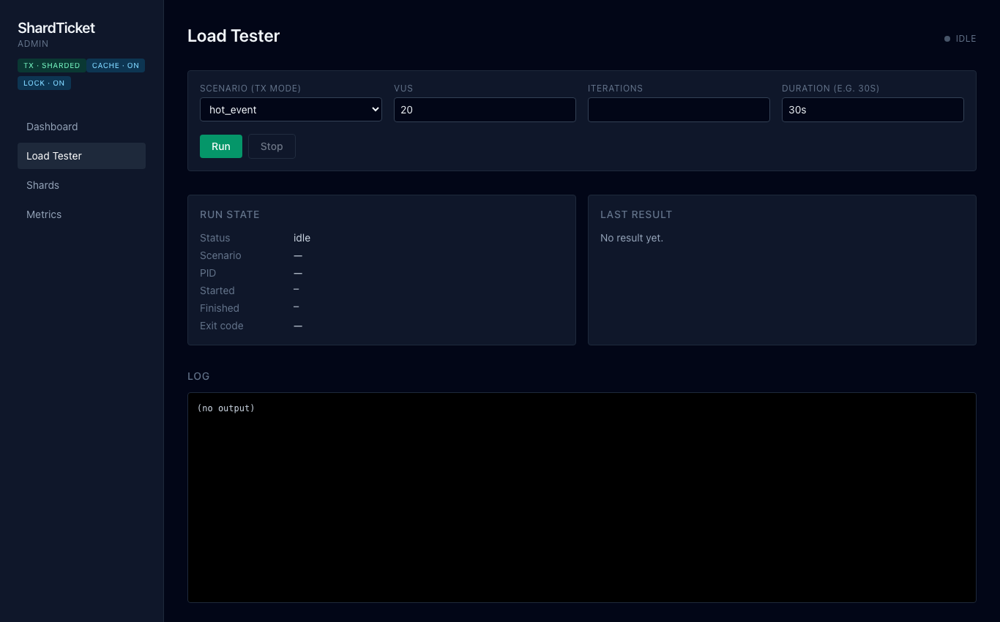
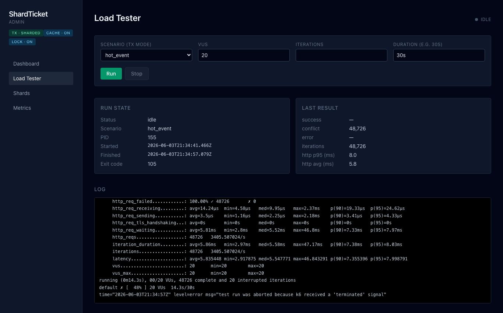
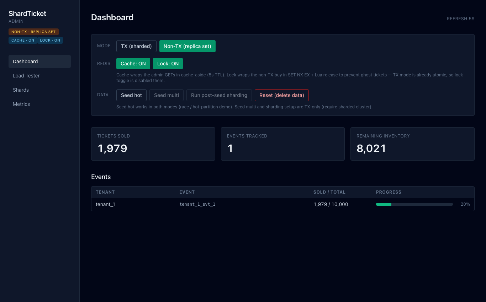

# ShardTicket

> A research benchmark that puts two ticket-buying architectures side by side —
> a **sharded MongoDB cluster with ACID transactions** versus a **single
> replica set with no transactions** — and shows, under real concurrent load,
> why one oversells tickets and the other doesn't. Comes with a full admin
> panel, k6 load testing from the browser, Redis cache/lock toggles, and a
> live Prometheus + Grafana observability stack.


## Demo

**Load test from the browser** — pick a scenario, set the VUs and duration, hit
**Run**, and k6 fires inside the backend container while the live log streams
and the success / conflict / latency numbers fill in.



**Hot-swap the architecture** — flip between **TX (sharded)** and **Non-TX
(replica set)** from the dashboard. The backend rewrites its `.env`, nodemon
respawns the process (no container restart), and the sidebar badge flips when
the new mode comes online.



**Live buying** — start from zero and watch the dashboard update in real time
as a load test buys tickets: "Tickets sold" climbs, "Remaining inventory"
drops, and every event's sell-through bar fills.



## What is ShardTicket

ShardTicket is a Node.js/Express project that answers one question with real
numbers: **what happens when hundreds of people try to buy tickets for the same
event at the exact same moment?** It ships two complete, swappable backends
behind the same API and an admin panel to drive, load-test, and observe them.

Key features:

- **Two purchase flows, one toggle** — `USE_TRANSACTIONS=true` routes to a
  sharded cluster using `session.withTransaction()` with retries on
  `WriteConflict`; `false` routes to a standalone replica set running an
  intentionally racy *read → wait → write* flow that oversells. Switchable at
  runtime from the UI.
- **Sharded MongoDB cluster** — `mongos` router + two shards + a config server,
  initialized automatically on first boot. The shard key `{ tenantId, eventId }`
  colocates an event and its tickets on one shard so transactions stay local.
- **Admin panel** — a Vite + React + Tailwind dashboard: live stat cards, an
  events table with sell-through progress bars, mode/flag/data controls, shard
  topology and per-tenant charts, an embedded Grafana view, and a load tester.
- **k6 load testing, in-app** — k6 is bundled into the backend image; run
  scenarios over HTTP or from the Load Tester page (the scenario list
  auto-filters by the active mode), watch the streamed log, and read the parsed
  summary.
- **Redis cache + distributed lock** — feature-flagged from the UI: cache-aside
  (5 s TTL) on the admin GETs, and a `SET NX EX` + Lua-release lock that closes
  the overselling race on the non-transactional path. TX mode is already
  atomic, so the lock toggle is disabled there.
- **Full observability** — the backend exposes Prometheus metrics (buy
  throughput, latency histogram, retries, write conflicts); Prometheus scrapes
  it every 5 s; Grafana auto-provisions a four-panel dashboard, embedded in the
  admin panel.
- **Secure by default** — `helmet`, a 100 kb JSON body limit, `zod` validation
  on every POST body, rate limits on the hot buy/admin endpoints, and a
  non-root (`USER node`) backend container with a `.dockerignore`.
- **Tested** — 135 passing tests (Vitest): backend unit + integration
  (`supertest` + `mongodb-memory-server`) with enforced coverage thresholds,
  and frontend component tests (React Testing Library + jsdom). 105 backend +
  30 frontend.

## Screenshots

| | |
| --- | --- |
| **Dashboard** — stat cards, controls, events table | **Controls** — mode / Redis flags / data |
|  |  |
| **Shards** — topology + tickets per tenant | **Metrics** — embedded Grafana dashboard |
|  |  |
| **Load Tester** — scenario config + run state | **Load Tester** — result + streamed log |
|  |  |
| **Non-TX mode** — the racy replica-set flow | |
|  | |

## Tech stack

| Area | Technologies |
| ---- | ------------ |
| **Backend** | Node.js 18, Express 4, Mongoose 7, `zod` validation, `helmet`, `express-rate-limit` |
| **Database** | MongoDB sharded cluster (`mongos` + 2 shards + config server) and a standalone replica set |
| **Cache & locking** | Redis 7 via `ioredis` — cache-aside + `SET NX EX` / Lua distributed lock |
| **Frontend** | React 18, Vite, TypeScript, Tailwind, React Router, TanStack Query, Recharts |
| **Load testing** | k6 (bundled into the backend image, run over HTTP or from the UI) |
| **Observability** | `prom-client`, Prometheus, Grafana (auto-provisioned dashboard) |
| **Testing** | Vitest, Supertest, `mongodb-memory-server`, React Testing Library, jsdom |
| **Containers** | Docker + docker-compose (9 services) |

```
ShardTicket/
├── backend/               # Express API (nodemon live-reload)
│   ├── src/
│   │   ├── routes/        # buy, events, admin, k6
│   │   ├── services/      # buyTicket.js (TX), buyTicketNonTransactional.js, cache.js, lock.js
│   │   ├── models/        # Tenant, Event, Ticket
│   │   ├── validation/    # zod schemas
│   │   └── metrics/       # prom-client registry
│   ├── scripts/           # seed.js, post_seed_sharding.js
│   └── test/              # unit/ + integration/ (vitest)
├── frontend/              # Vite + React admin panel (port 5173)
│   ├── src/pages/         # Dashboard, LoadTester, Shards, Metrics
│   └── test/              # component tests (vitest + RTL)
├── docker/                # docker-compose.yml (full stack) + mongo-init/
├── k6/scenarios/          # hot_event, hot_event_sharded, non_transactional, admin_dashboard_load
├── monitoring/            # prometheus/ + grafana/ provisioning
├── scripts/               # shell orchestration (run_all.sh, seed_*, test_*)
└── tools/screenshots/     # screenshot / GIF capture harness for the docs
```

## Getting started

**Requirements:** Docker + Docker Compose. (Node.js 18+ only if you want to run
a service outside containers.)

The whole thing runs in Docker. From the repo root:

```bash
cp backend/.env.example backend/.env
cd docker && docker compose -f docker-compose.yml up -d
```

Then open the admin panel at <http://localhost:5173>.

First-time data setup (or use the dashboard's **Data** buttons):

1. **Seed** — Dashboard → *Seed hot* (1 event × 10k tickets) or *Seed multi*
   (3 tenants × 10 events).
2. **Shard it** (TX mode) — *Run post-seed sharding* enables sharding, splits a
   chunk and moves `tenant_2` to `shard2`. Idempotent.
3. **Load test** — Load Tester page → pick a scenario → **Run**.

### Services & ports

| Service | Port (host) | Purpose |
| ------- | ----------- | ------- |
| frontend | `5173` | Vite + React admin panel (HMR) |
| backend | `3000` | Express API + bundled k6 (nodemon) |
| mongos | `27021` | Sharded cluster router |
| mongo | `27017` | Standalone replica set (non-TX mode) |
| redis | `6379` | Cache + lock store |
| redis_exporter | `9121` | Redis metrics for Prometheus |
| prometheus | `9090` | Scrapes `backend:3000/metrics` every 5 s |
| grafana | `3001` | Auto-provisioned dashboard (anonymous viewer) |

`shard1`, `shard2` and `configsvr` run without host ports.

### Run a service for development

Both `backend/` and `frontend/` source dirs are mounted into their containers,
so edits live-reload via nodemon / Vite HMR — no rebuild needed. To run the
backend outside Docker instead:

```bash
cd backend
npm install
npm run dev        # nodemon src/app.js (needs backend/.env)
npm run seed       # SEED_MODE + USE_TRANSACTIONS from env
```

### Tests

```bash
cd backend  && npm test    # unit + integration, with coverage thresholds
cd frontend && npm test    # component tests, with coverage report
```

## The two purchase flows

This is the core of the project — `USE_TRANSACTIONS` selects which database and
which buy implementation are live.

| | TX mode | Non-TX mode |
| --- | --- | --- |
| **Flag** | `USE_TRANSACTIONS=true` | `USE_TRANSACTIONS=false` |
| **Route** | `POST /tenants/:tenantId/events/:eventId/buy` | `POST /demo/non-transactional/:tenantId/:eventId/buy` |
| **Service** | `buyTicket.js` | `buyTicketNonTransactional.js` |
| **Database** | Sharded cluster via `mongos` | Standalone replica set |
| **Logic** | `findOneAndUpdate` + `$inc: { remainingTickets: -1 }` inside `session.withTransaction()`, ≤5 retries on `WriteConflict` | read count → wait 10 ms → create ticket → save event (three separate ops) |
| **Result under load** | Correct — never oversells | Oversells: concurrent buyers read the same count |

Toggle it at runtime from the dashboard (the backend rewrites `.env` and nodemon
respawns), or via `POST /admin/mode`.

## Seeding & load testing

**Seed** (`POST /admin/seed`, or `SEED_MODE=hot|multi node backend/scripts/seed.js`):

- `hot` — 1 tenant × 1 event × 10,000 tickets — hot-partition / race demo.
- `multi` — 3 tenants × 10 events × 5,000 tickets each — distributed workload
  (TX mode only).

**k6 scenarios** (run from the Load Tester page or `POST /k6/run`):

| Scenario | Modes | What it shows |
| --- | --- | --- |
| `hot_event` | tx | Single hot event under transaction contention |
| `hot_event_sharded` | tx | Load spread across tenants/events → shard distribution |
| `non_transactional` | nontx | Overselling under concurrency |
| `admin_dashboard_load` | tx, nontx | Read load on the admin GETs (cache demo) |

```bash
curl -X POST http://localhost:3000/k6/run \
  -H 'Content-Type: application/json' \
  -d '{"scenario":"hot_event_sharded","vus":20,"duration":"30s"}'
curl http://localhost:3000/k6/status     # state + log tail + parsed summary
```

The orchestrated full benchmark lives in `scripts/run_all.sh`; see
`scripts/SCRIPTS_README.txt` for the complete script reference.

## API endpoints

All bodies are JSON; POST bodies are `zod`-validated.

### Buying

| Method | Path | Notes |
| ------ | ---- | ----- |
| POST | `/tenants/:tenantId/events/:eventId/buy` | Transactional buy (TX mode) |
| POST | `/demo/non-transactional/:tenantId/:eventId/buy` | Non-transactional buy (race demo) |

### Events

| Method | Path | Notes |
| ------ | ---- | ----- |
| GET | `/events/tenant/:tenantId` | Events for a tenant |
| GET | `/events/:eventId` | Single event |

(For the full event list with sell-through, use `GET /admin/events`.)

### Admin

| Method | Path | Notes |
| ------ | ---- | ----- |
| GET | `/admin/events` | Event summary (`remaining`/`total`) |
| GET | `/admin/tickets/count` | Total sold ticket count |
| GET | `/admin/shard-distribution` | Shard list + tickets grouped by tenant |
| GET / POST | `/admin/mode` | Read / set `tx` \| `nontx` (rewrites `.env`, reloads) |
| GET / POST | `/admin/flags` | Read / set `USE_REDIS_CACHE`, `USE_REDIS_LOCK` |
| GET | `/admin/redis/health` | Redis readiness |
| POST | `/admin/seed` | Run seed (`{ mode: hot \| multi }`) |
| POST | `/admin/sharding/post-seed` | Enable sharding + split + move chunk (TX-only) |
| POST | `/admin/reset` | `deleteMany` tickets + events (sharding preserved) |

### Load testing & metrics

| Method | Path | Notes |
| ------ | ---- | ----- |
| GET | `/k6/scenarios` | Whitelist + per-scenario allowed modes |
| POST | `/k6/run` | `{ scenario, vus?, iterations?, duration? }` |
| POST | `/k6/stop` | SIGTERM the running k6 process |
| GET | `/k6/status` | State + log tail + last parsed summary |
| GET | `/k6/results` | Last summary JSON |
| GET | `/metrics` | Prometheus exposition format |

## Observability

The backend exposes custom Prometheus metrics on `/metrics`:

- `ticket_buy_total{mode, result}` — counter (`result`: success / sold_out / conflict / error)
- `ticket_buy_latency_ms{mode, result}` — histogram
- `ticket_buy_retries_total{mode}` — `withTransaction` callback re-invocations
- `mongo_writeconflict_total{mode}` — write-conflict counter

**Prometheus** (<http://localhost:9090>) scrapes `backend:3000/metrics` and the
`redis_exporter` every 5 s. **Grafana** (<http://localhost:3001>, anonymous
viewer) auto-provisions the dashboard *"ShardTicket — Buy Flow"* with four
panels — throughput, latency p50/p95, retries rate, write-conflict rate — which
is embedded in the admin panel's **Metrics** page.

## MongoDB data model

Three collections share the shard key `{ tenantId: 1, eventId: 1 }` to colocate
related documents and avoid cross-shard transactions:

- `tenants` — `{ tenantId, name, plan }`
- `events` — `{ tenantId, eventId, title, remainingTickets, totalTickets, price, date }`
- `tickets` — `{ ticketId, tenantId, eventId, userId, seat, purchasedAt }`

`remainingTickets` is the contention point.

## Future improvements

Known gaps and where the project could go next:

**Scaling & sharding**
- Add a third shard and demonstrate live chunk **rebalancing** under the
  balancer, not just a one-off `moveChunk`.
- Compare alternative **shard keys** (e.g. hashed `eventId`) side by side to
  show hot-chunk vs. even-distribution trade-offs.
- Tune the Mongoose **connection pool / server-selection timeouts** — high VU
  counts can exhaust the pool and surface as buffering timeouts.

**Ticketing depth**
- **Extend the sharded + transactional pattern to more collections** — today
  the contention demo centers on `events` / `tickets`; the same shard-key and
  `withTransaction` approach can drive `orders`, `payments`, `reservations`,
  `seat_holds`, and `refunds` so a single buy spans several tables atomically.
- **Build out a fuller ticketing domain** — seat maps, time-boxed holds,
  waiting-room queues, per-tenant pricing tiers and promo codes — each a new
  axis of concurrency and a new sharding case study.

**Correctness & data**
- **Event-driven cache invalidation** on writes instead of the current 5 s TTL,
  so admin reads are both fresh and cheap.
- Real **seat selection** and a simulated **payment** step to make the buy flow
  closer to a production ticketing system.

**API & security**
- **Authentication / RBAC** on the admin and k6 control endpoints (currently
  open for demo convenience).
- Per-tenant **API keys** and quota enforcement.

**Observability & testing**
- Persist **k6 run history** and add a Grafana panel that compares throughput /
  p95 across runs (regression tracking).
- **Prometheus Alertmanager** rules — e.g. alert on a write-conflict-rate spike.
- Raise **frontend test coverage** (currently partial) and add **end-to-end UI
  tests** for the dashboard control flows.
- Replace the 5 s dashboard polling with **SSE / WebSocket** push for smoother
  live updates.

**Delivery**
- A **CI pipeline** (GitHub Actions) running both test suites + `npm audit` on
  every PR.
- **Kubernetes / Helm** manifests for the sharded cluster as an alternative to
  docker-compose.
